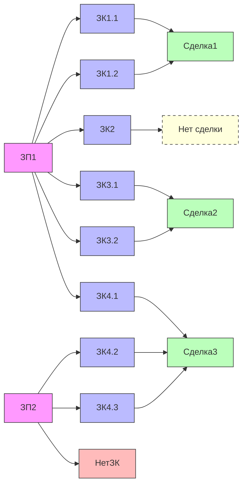

```mermaid
graph LR
    %% Заказы поставщику
    ЗП1 --> ЗК1.1
    ЗП1 --> ЗК1.2
    ЗП1 --> ЗК2
    ЗП1 --> ЗК3.1
    ЗП1 --> ЗК3.2
    ЗП1 --> ЗК4.1
    
    ЗП2 --> ЗК4.2
    ЗП2 --> ЗК4.3
    ЗП2 --> НетЗК
    
    %% Связи заказов клиента со сделками
    ЗК1.1 --> Сделка1
    ЗК1.2 --> Сделка1
    
    ЗК3.1 --> Сделка2
    ЗК3.2 --> Сделка2
    
    ЗК4.1 --> Сделка3
    ЗК4.2 --> Сделка3
    ЗК4.3 --> Сделка3
    
    %% У ЗК2 нет сделки
    ЗК2 --> НетСделки[Нет сделки]
    
    %% Группировка для наглядности
    classDef zp fill:#f9f,stroke:#333;
    classDef zk fill:#bbf,stroke:#333;
    classDef deal fill:#bfb,stroke:#333;
    classDef none fill:#fbb,stroke:#333;
    classDef noDeal fill:#ffd,stroke:#333,stroke-dasharray: 5 5;
    
    class ЗП1,ЗП2 zp;
    class ЗК1.1,ЗК1.2,ЗК2,ЗК3.1,ЗК3.2,ЗК4.1,ЗК4.2,ЗК4.3 zk;
    class Сделка1,Сделка2,Сделка3 deal;
    class НетЗК none;
    class НетСделки noDeal;
```
