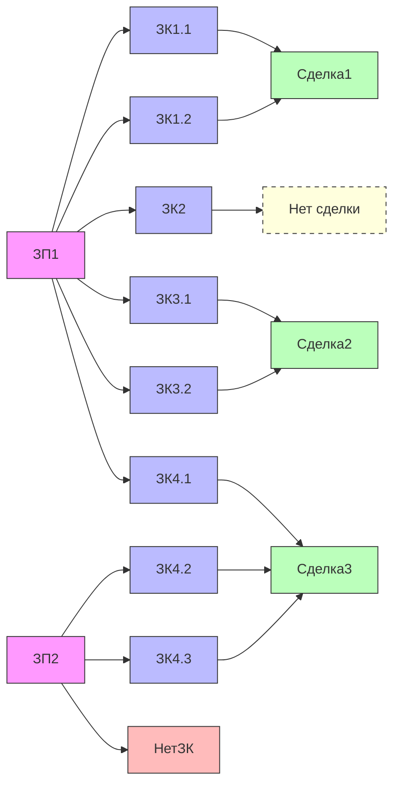
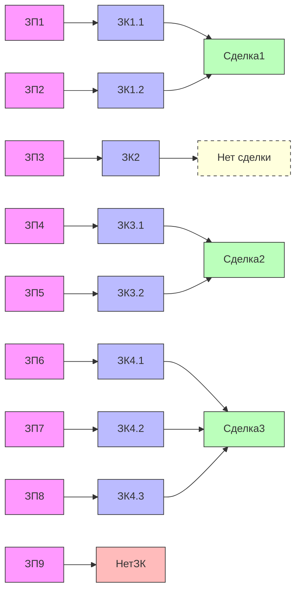

# Описание работы на стороне ТД ЛФ
<!--TOC-->
  - [Расширение и рабочее место с работой ИФЗ](#-)
    - [Общее](#)
    - [Настройки работы с заказами](#-)
  - [Обмен заказами](#-)
    - [Выгрузка](#)
<!--/TOC-->
Термины и сокращения
* ЗК - Заказ клиента
* ЗП - Заказ поставщику
## Расширение и рабочее место с работой ИФЗ
### Общее
* Создание рабочего места для работы с ИФЗ
* Создание роли доступа к рабочему месту
### Настройки работы с заказами
* Выбор типа цены при создании ЗП
* Период обрабатываемых ЗК
* Обрабатывать только обособленные товары(bool)
* Контрагент и партнер создаваемых ЗП
---
## Обмен заказами
### Выгрузка
Схема работы выглядит примерно таким образом. И имеют свой недостаток при обмене с ИФЗ. У ИФЗ предполагается, что на каждый заказ клиента создаётся по реализации. Когда плановая работа состоит несколько иначе.

 

 <b> Плановое Объединённые ЗП (многие-ко-многим) (Нажми развернуть) <b> 

 

 

 <b> ИФЗ Индивидуальные ЗП (один-к-одному) (Нажми развернуть)<b> 

 

То есть, затем создаётся реализация по каждому заказу. И могут возникнуть трудности при работе с общим заказом поставщику.

Исходя из диаграмм, полную потребность закрывают только заказы поставщику, их и будем отправлять.
Создавать вручную десяток заказов не имеет смысла автоматизации.
Также предусмотреть ручное создание заказов Поставщику.

Потребуется регламентное задание и регистр, где можно отмечать создание ЗП и статус выгрузки.

Обрабатываем все проведенные ЗК исходя из настроек.
На каждый ЗК создаём ЗП, по типовому правилу "на основании", если такое возможно 1С.
Оно подразумевает, что заполняется сделка, автор, остальные поля и табличная часть, где есть только неотмененные строки и в состоянии к обеспечению. Обособленность берем из настроек.
Если ТЧ в создаваемом заказе пустая, ничего не делаем, переходим к следующему ЗК. Тем самым, проверяем ручное создание ЗП и добавление новых строк в заказ клиента.

Запрос делает сторона ИФЗ, выгружаем данные согласно описанному API.

Комментарий при выгрузке:
* Сделка - номер/код
* ЗП - номер/код
* ЗК - номер/код
* Склад отгрузки - представление. Здесь предстоит подумать, у каждой строки ТЧ товаров имеется склад и он может отличаться, тк это управление отгрузками менеджера.

